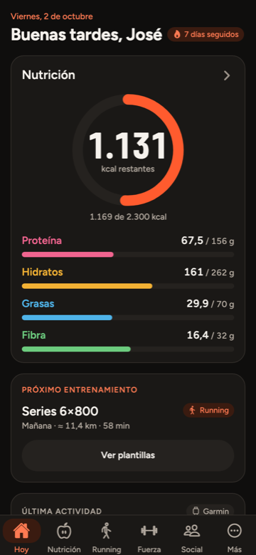
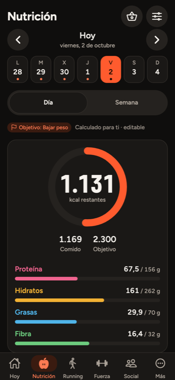
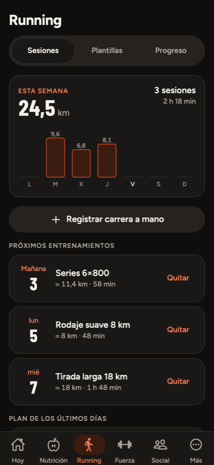
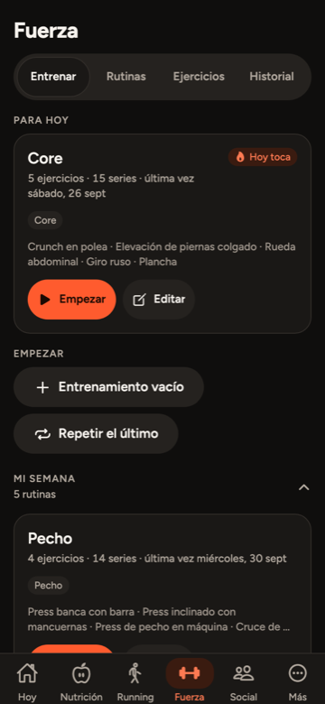
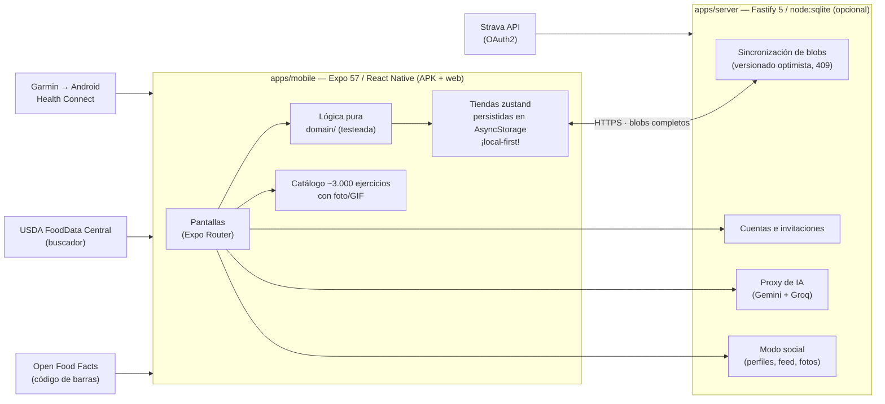

# CheluisFIT

App de fitness para uso personal y de amigos y familia: **nutrición**, **running** y **fuerza**.
Android nativo (APK propio, sin tiendas) y **web**, con datos **en el dispositivo primero** y
sincronización opcional con un **servidor propio**.

| Hoy | Nutrición | Running | Fuerza |
|---|---|---|---|
|  |  |  |  |

*Capturas reales de la app (datos de ejemplo), tema oscuro.*

## Qué hace

- **Nutrición** — diario de comidas con kcal y macros (proteína/hidratos/grasa/fibra), objetivo
  calculado para ti con **TDEE adaptativo** que corrige el objetivo según cómo responde tu peso
  real (siempre con tu confirmación), registro de peso y medidas, escáner de **código de barras**
  con **Open Food Facts en vivo**, buscador de texto ampliado con **USDA FoodData Central** en
  vivo (+600.000 alimentos, más los platos caseros españoles precargados) y escaneo de producto
  **por foto con IA**.
- **Running** — registro de carreras y caminatas, plantillas de entrenamiento (series, rodajes,
  tiradas), plan semanal, récords personales (mejor ritmo, marcas 5K/10K/media), gráficas de
  progreso e importación real desde **Garmin vía Android Health Connect** o **Strava** (OAuth2,
  con recorrido GPS).
- **Fuerza** — rutinas con progresión de cargas, biblioteca de **~3.000 ejercicios** con foto o
  GIF animado, entreno en curso con temporizador de descanso y notificaciones, récords (1RM),
  historial y "repetir el último entreno".
- **Asistente de IA** — burbuja flotante (Gemini, con Groq de respaldo) que conoce tu contexto
  real (lo que comiste, tus carreras, tus entrenos) y **propone** cambios que tú confirmas antes
  de que se apliquen — nunca escribe nada por su cuenta.
- **Modo social** — perfiles públicos o privados, seguir gente, feed con posts vinculados a una
  carrera o entreno real (con snapshot, no tus datos), comentarios y likes.
- **Local-first de verdad** — funciona sin cuenta y sin red; con cuenta, sincroniza los datos
  entre dispositivos con control de versiones optimista (y copia local en caso de conflicto).
  Exporta tus datos en JSON cuando quieras.

## Cómo está hecho



Decisiones de arquitectura y dominio (por qué blobs enteros en vez de tablas normalizadas, cómo
se resuelven conflictos, límites de la IA, la integración con Garmin/Strava pieza a pieza…):
[`AGENTS.md`](AGENTS.md) — la fuente única de verdad para cualquier agente que toque el código.

## Arrancar

```bash
export PATH="/opt/homebrew/opt/node@22/bin:$PATH"
pnpm install
cd apps/mobile
npx expo start --web            # navegador: http://localhost:8081
npx expo start --android        # emulador Android (instala Expo Go solo)
pnpm typecheck && pnpm test     # comprobaciones (tipos + lógica, ~300 tests)
pnpm e2e                        # exporta la web y pasa Playwright + axe (~156 pruebas)
cd ../server && pnpm test       # tests del servidor
```

La búsqueda en vivo de alimentos de **USDA** necesita una clave gratuita de
[api.data.gov](https://api.data.gov) en la variable `EXPO_PUBLIC_USDA_API_KEY` (sin ella la
búsqueda local y Open Food Facts funcionan igual; la app avisa de que falta la clave).

**Expo Go ya no basta** para probar la app completa: las notificaciones de fin de descanso y
Health Connect (Garmin) son módulos nativos que solo existen en un APK/*development build*
(`npx expo run:android`). Expo Go sigue sirviendo para iterar rápido en el resto de pantallas.

## Estructura

```
apps/mobile/src
  app/         rutas (Expo Router): (tabs)/ = Hoy, Nutrición, Running, Fuerza, Social, Más
  components/  ui/ = sistema de diseño; nutrition/, running/, charts/, ai/, social/
  domain/      lógica pura sin React Native (objetivos, nutrientes, GTIN, running, TDEE)
  data/        estado local (zustand+AsyncStorage) + datos de ejemplo + clientes de red
               (Open Food Facts, USDA, Health Connect/Garmin, servidor, Strava)
apps/server/src
  db.ts, auth.ts, app.ts, server.ts, routes/  Fastify + node:sqlite: cuentas, sincronización
                                              de blobs, fotos, proxy de IA y modo social
```

Las decisiones de diseño del modo social están en `docs/plan-social.md`.

## Copias de seguridad y cómo restaurar

- **Automáticas**: el servidor hace una copia consistente (`VACUUM INTO`) cada 6 h en
  `~/servicios/cheluisfit/data/backups/cheluisfit-AAAA-MM-DD.db` (una por día, 14 días) y
  `tools/deploy.mjs` hace otra, `pre-<versión>-<ms>.db`, justo antes de cada actualización.
- **Restaurar una copia** (en el VPS):
  ```sh
  cd ~/servicios/cheluisfit
  docker compose stop
  cp data/cheluisfit.db data/cheluisfit.db.antes-de-restaurar   # por si acaso
  cp data/backups/<la copia>.db data/cheluisfit.db
  rm -f data/cheluisfit.db-wal data/cheluisfit.db-shm             # si no, SQLite reaplicaría cambios posteriores
  docker compose up -d
  ```
- **Volver a la versión anterior** si una actualización sale mal (el despliegue ya lo intenta solo
  si `/health` no responde): `sed -i "s|image: cheluisfit:.*|image: cheluisfit:<anterior>|" docker-compose.yml`,
  lo mismo con `APP_VERSION=` en `.env`, y `docker compose up -d` (las imágenes anteriores siguen
  cargadas: `docker images cheluisfit`).
- **Copias cruzadas** (`node tools/backup-offsite.mjs`, y solas al final de cada despliegue):
  las copias de la base de datos bajan al Mac (`~/Copias/cheluisfit/db/`), y el código con todo su
  historial (`git bundle`; restaurar: `git clone repo-<fecha>.bundle cheluisfit`) y la clave de
  firma del APK suben al VPS (`~/backups/cheluisfit/`). La **contraseña** de la clave
  (`~/.android-keystores/cheluisfit.properties`) no sale del Mac: guárdala en tu gestor de
  contraseñas. Sin clave ni contraseña, las actualizaciones dejarían de instalarse encima.

## Próximos pasos

De lo más cercano a lo más lejano:

- **Activar el asistente de IA en producción**: el código ya está desplegable, pero hace falta
  crear las claves gratuitas (`aistudio.google.com/apikey` para Gemini, `console.groq.com/keys`
  para Groq — ninguna pide tarjeta) y añadirlas a mano al `.env` del VPS
  (`GEMINI_API_KEY`/`GROQ_API_KEY`, ver `AGENTS.md`); sin al menos una, la burbuja no responde.
- **Verificación en dispositivo real** (solo la puede hacer quien tenga el móvil y el reloj):
  instalar el APK desde `/app.apk?v=<versión>` (**con el `?v=`, nunca a secas** — Cloudflare
  cachea `.apk` en su borde ~4h ignorando la cabecera del servidor; `node tools/deploy.mjs`
  imprime la URL correcta al final de cada despliegue), confirmar en Garmin Connect → Ajustes →
  Health Connect → «Escribir» → Sesiones de ejercicio activado, probar una sincronización real,
  escanear un producto de supermercado de verdad, probar el asistente de IA con datos reales y
  probar lo social con dos cuentas de verdad (follow, publicar, comentar, dar like, perfil privado).
- **Notificaciones sociales** (fuera de v1 a propósito, ver `docs/plan-social.md`): «X te ha
  seguido/comentado» necesitaría push o un cron, ninguno existe hoy.
- **Fútbol**: pestaña sin diseñar todavía. Health Connect ya expone `ExerciseType.SOCCER`,
  ignorado a propósito en la importación de Garmin hasta que exista.
- **Vídeos propios de ejercicios de Fuerza** (hoy son fotos de free-exercise-db).
- **Recuperación de contraseña**: el esquema de cuentas no la tiene, a diferencia de Compra en
  Familia — se puede añadir copiando su patrón si hace falta.

## Licencia

Código bajo [MIT](LICENSE) © José Luis García Valverde. Los datos de terceros (Open Food
Facts, USDA, catálogo de ejercicios, GIF) conservan sus propias licencias: ver
[NOTICE.md](NOTICE.md).
